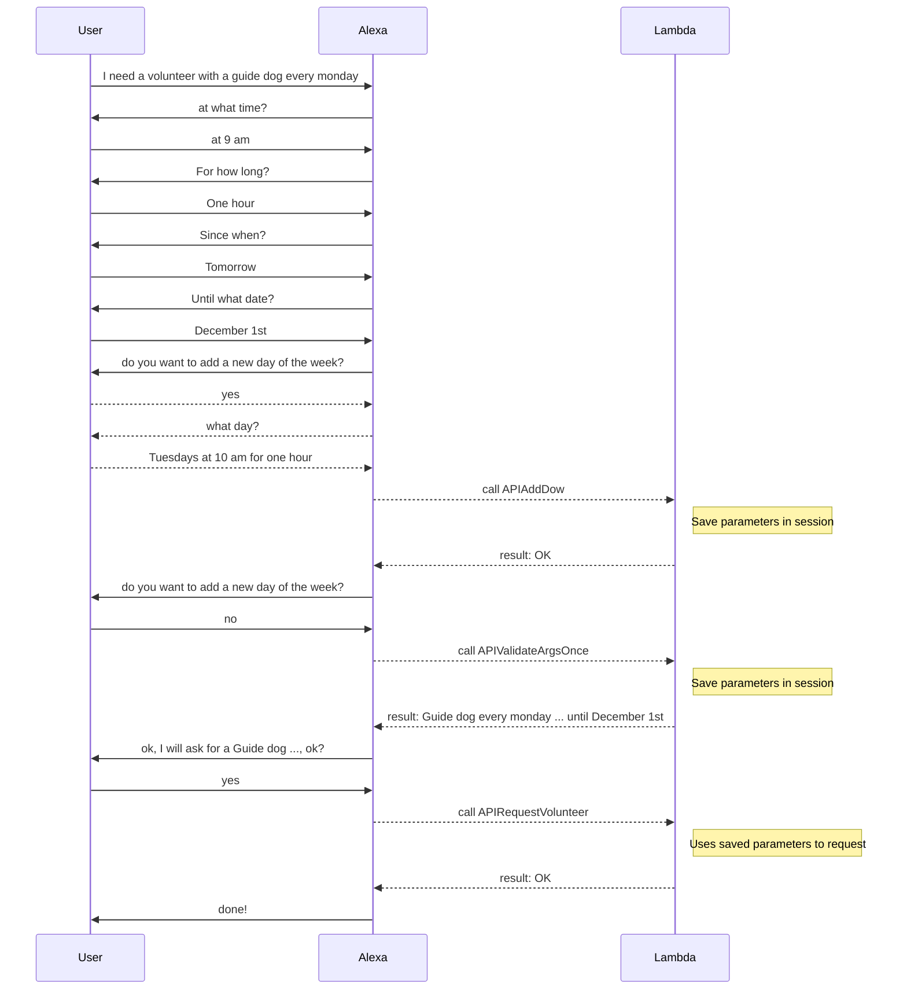

# Volunteers Skill

## The problem

We have a skill that allows a blind user to request a volunteer from an association that helps blind people in Spain.

You can request a volunteer for a single time, or recurringly.

You have to specify what you need the volunteer for. There are several predesignated services 
(ie guide dog, braille assistance, phone assistance, etc.)

Then you need to tell when and for how long will you need assistance.

If the request is recurring (ie, every monday), you can specify more than one time per week.

There are services that have constraints. (Just one of them: family assistance, it's only if both spouses are blind)
If the user selects this service, the skill has to inform this.

When all data is collected, the request is made. I can go well, or it can be rejected, for example, if the
date/time requested overlaps with a previous request made.

## What we did

We created two skills, one in console and other in ACDL, they are practically the same. That because we want to learn both ways to do it, and also because we are more confortable with code than the console.

## The interaction

This is a sequence diagram of an example interaction requesting a volunteer a single time. 

This sequence diagram represents an example interaction requesting a volunteer recurringly. 

## Some issues

* Slot confirmation
    When we want to confirm the slots that the conversation collected, we only have the "heard as" value, not the resolved value. So we cannot confirm the service as it is called, but only as the user requested it.
    An example is like a flight book skill: if i ask for a ticket to the big apple, the confirmation cannot say, 
    ok, i will book a flight to New York.

    To work around that, we used an API call, passing the parameters, and returning the string with 
    the confirmation request. But it is a "API Sucess" act, not a "Confirm API" act, so it is a little weird.

* What happens if the API call returns error
    If the API Call comes back in error (ie, "service overlaps") can we modify the parameters and re send the call?
    we are not sure how.

* There are some particulars in Spanish that we want to try, but we do not have access to that beta yet. 
    For example, it's not the same "el martes a las diez" to "los martes a las diez" (first one meaning this tuesday at 10am, the second implies "every tuesday at 10 am")

* How to loop in the conversation (ie do you want to add a new day?) until the user denies, and then do the call.